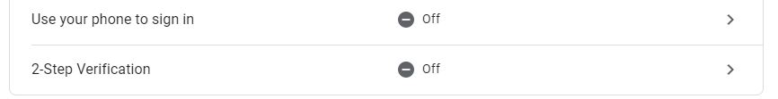

# Save Stealer
> I stopped developing this repo for a month already. 

a save.dat stealer written in python by Zenqi using SMTP server. For educational purposes only. I must not involve in any illegal activities you have done. Feel free to join my [discord server](ttps://discord.gg/qfJUWpr) if you have a problem.

## Requirements

Make sure you have [Python 3.x](https://python.org) 

```bash
pip install -r requirements.txt
```
.JPG)

## How to use

.JPG)

## Note
Make sure you disabled this on your google account.



And turn on "less secure app"
.JPG)

# Making Executable file

```bash
pyinstaller -F -i <icon path> stealer.py
```
### or watch this [video](https://www.youtube.com/watch?v=lOIJIk_maO4)

## License
[GNU Public Liscense](https://www.gnu.org/licenses/gpl-3.0.en.html)
